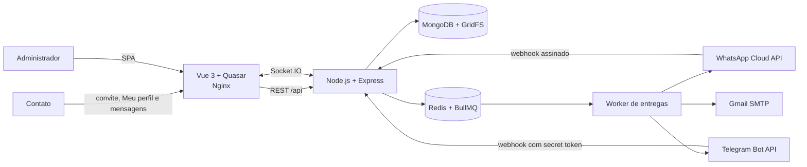

# Notify Flow — Produto de Software e Entrega Gate 5

O **Notify Flow** é o produto de software desenvolvido no Trabalho de Conclusão de Curso de **Samuel Victor Oliveira Lima**. A solução centraliza notificações por **WhatsApp Cloud API oficial**, **Telegram Bot API** e **Gmail**, com consentimento por canal, templates reutilizáveis, filas, webhooks, acompanhamento em tempo real e evidências de entrega.

Repositório canônico da entrega: [samuelvictorol/tcc-prti-samuelvictor](https://github.com/samuelvictorol/tcc-prti-samuelvictor).

## Sumário da entrega Gate 5

| Item | Conteúdo |
|---|---|
| [Relatório Técnico Gate 5](docs/Relatorio-Tecnico-Notify-Flow-Gate-5-Samuel-Victor-Oliveira-Lima.docx) | Evolução do Gate 4, arquitetura implementada, testes, resultados, limitações e próximos passos. |
| [Índice da documentação](docs/README.md) | Mapa dos documentos técnicos e das evidências do projeto. |
| [API](api/README.md) | Camadas, contratos, segurança, persistência, filas, integrações e webhooks. |
| [Frontend](frontend/README.md) | Rotas, componentes, estado, realtime, build e publicação. |
| [Regras dos canais](docs/CHANNELS.md) | Capacidades e limitações operacionais de Telegram, WhatsApp Cloud e Gmail. |
| [Mídias do aplicativo](docs/app-media/README.md) | Convenção para anexar capturas de tela e vídeos demonstrativos sem expor dados sensíveis. |

Não há apresentação em slides como requisito desta entrega. O relatório técnico e os artefatos acima constituem a documentação principal do Gate 5.

## Problema e proposta

Organizações que utilizam vários canais normalmente repetem cadastros, perdem rastreabilidade do consentimento e tratam falhas de forma manual. No WhatsApp, automações não oficiais ainda adicionam risco de bloqueio e não fornecem o mesmo contrato operacional da plataforma da Meta.

O Notify Flow responde a esse problema com:

- integração com a **WhatsApp Cloud API oficial**, inclusive templates aprovados, janela de atendimento e receipts;
- bot Telegram com comandos de autorização, onboarding, mídia e menus hierárquicos;
- Gmail SMTP para mensagens em texto ou HTML sanitizado;
- contatos unificados, grupos, convites e permissões independentes por canal;
- campanhas rápidas, por template ou por conjunto multicanal;
- BullMQ/Redis para fila, tentativas e isolamento de falhas por destinatário;
- MongoDB para estado durável, auditoria e mídia em GridFS;
- Socket.IO para conversas, eventos e avisos administrativos em tempo real;
- área **Meu perfil** para o titular consultar dados, vínculos, histórico e permissões;
- personalização Whitelabel e gestão administrativa do armazenamento.

## Escopo funcional

| Canal | Envio de campanha | Entrada e acompanhamento | Regra central |
|---|---|---|---|
| WhatsApp Cloud | Templates oficiais aprovados; respostas livres na janela de atendimento | Webhook Meta, chat local e receipts | Fora da janela de 24 horas, a empresa deve usar um template elegível. |
| Telegram | Texto, foto, vídeo e menus/submenus | Webhook, conversas e callbacks em tempo real | O bot só envia em privado depois de conhecer o `chat_id`; consentimento para campanhas é registrado pelos comandos configurados. |
| Gmail | Texto e HTML sanitizado | Resultado individual de envio | Exige endereço válido, provedor configurado e permissão do contato. |

Em campanhas multicanal, cada entrega é independente. Um contato sem identidade, sem permissão ou com erro em determinado provedor não interrompe os demais destinatários ou canais. O histórico identifica envios, skips, falhas, tentativas e atualizações assíncronas do provedor.

## Arquitetura



O backend adota o fluxo `route -> DTO/middleware -> controller -> manager -> model/service`. Dados duráveis e auditoria ficam no MongoDB; Redis coordena filas, deduplicação e estados temporários; o frontend usa a API como fonte de verdade e aplica atualizações incrementais por Socket.IO.

## Jornadas principais

### Administrador

1. Configura cada provedor de forma independente na página **Início**.
2. Cadastra contatos, grupos, convites, templates e conjuntos de templates.
3. Seleciona destinatários e revisa a prévia por canal antes de enfileirar.
4. Acompanha entrega, leitura, falha, retry, webhook e contatos sem permissão.
5. Personaliza marca e cores, acompanha uso do banco e exporta dados autorizados pela área Whitelabel.

### Contato

1. Chega por convite, Telegram ou WhatsApp oficial.
2. Concede ou revoga autorização conforme o canal e a finalidade.
3. Usa `/login` ou o fluxo público para acessar **Meu perfil** com vínculo seguro.
4. Consulta dados, convites, grupos e entregas associadas ao próprio cadastro.
5. Corrige dados ou remove permissões e vínculos permitidos pela interface.

## Organização do repositório

```text
notify-app/
├── api/                 API, worker, integrações e testes Node.js
├── frontend/            SPA Vue/Quasar, testes e Nginx
├── docs/                relatório Gate 5, regras, diagramas e evidências
├── docker-compose.yml   ambiente local completo
├── render.yaml          Blueprint de produção no Render
└── .env.example         catálogo seguro de configuração local
```

Arquivos `.env`, dependências instaladas, builds, logs, caches e artefatos temporários não fazem parte da entrega e não devem ser incluídos no pacote compactado.

## Execução local com Docker

Requisitos: Docker Engine/Desktop 24+ e Docker Compose v2.

```powershell
Copy-Item .env.example .env
# Substitua todos os valores de exemplo antes de usar dados reais.
docker compose up --build -d
docker compose ps
```

- Painel: <http://localhost:8080>
- Health ponta a ponta: <http://localhost:8080/api/health>
- API local direta: <http://localhost:3000/api/health>

O Compose inicia frontend, API, MongoDB e Redis. Os volumes `mongo_data` e `redis_data` preservam os dados locais. `docker compose down --volumes` remove esses volumes e só deve ser executado de forma intencional.

## Configuração segura

Use [.env.example](.env.example) como catálogo e nunca versione o `.env` real.

| Grupo | Exemplos |
|---|---|
| Infraestrutura | `PUBLIC_APP_URL`, `CORS_ORIGINS`, `MONGODB_URI`, `REDIS_URL` |
| Autenticação | `ADMIN{N}_*`, `JWT_*`, `PROFILE_JWT_SECRET` |
| Proteção de dados | `ENCRYPTION_KEY`, `SEARCH_HASH_KEY`, `INVITE_TOKEN_SECRET`, `MEDIA_SIGNING_SECRET` |
| Mídia | `MEDIA_PUBLIC_BASE_URL`, `MEDIA_RATE_LIMIT_MAX` |
| Canais | variáveis `TELEGRAM_*`, `WHATSAPP_CLOUD_*` e `GMAIL_*` |
| Consentimento | `START_NOTIFY_WHATSAPP_PERMISSION`, `START_VERIFY_TELEGRAM_PERMISSION` |

Credenciais cadastradas pela interface são criptografadas antes de serem persistidas. A UI recebe estado mascarado ou não sensível. Segredos, tokens, números completos, conteúdo privado e exports de banco não devem aparecer em capturas de tela ou no pacote acadêmico.

## Verificação técnica

```powershell
Set-Location api
npm ci
npm run check

Set-Location ..\frontend
npm ci
npm test
npm run build

Set-Location ..
docker compose config
```

Além da suíte automatizada, a validação de entrega deve registrar smoke tests dos webhooks, fila, receipts, revogação, janela de atendimento, mídia pública, exportação e restauração. Resultados executados e evidências pertencem ao Relatório Técnico Gate 5; números de teste não devem ser apresentados sem o respectivo comando, data e ambiente.

## Deploy

O [render.yaml](render.yaml) provisiona:

- frontend Docker público, que encaminha `/api` e `/socket.io`;
- API Docker privada;
- Render Key Value compatível com Redis;
- conexão externa com MongoDB Atlas por `MONGODB_URI`.

Em produção, `PUBLIC_APP_URL`, CORS, cookies seguros e URLs assinadas de mídia devem usar o domínio HTTPS público. Credenciais de Telegram, Meta e Gmail permanecem fora do repositório e podem ser cadastradas depois pela interface.

## Limites e responsabilidades

- A Meta não oferece uma rota para importar todo o histórico do aplicativo WhatsApp; a inbox local nasce dos webhooks e envios processados pelo Notify Flow.
- Aprovação, qualidade, preço e elegibilidade de templates continuam sob responsabilidade da Meta.
- A solução implementa controles técnicos relacionados à LGPD, mas não substitui definição de base legal, política institucional de retenção, encarregado ou parecer jurídico.
- O envio depende da disponibilidade e das políticas dos provedores externos.
- Exports e backups precisam de armazenamento seguro e controle de acesso fora da aplicação.

Consulte o [índice de documentação](docs/README.md) para detalhes de arquitetura, testes, operação e evidências da entrega.
