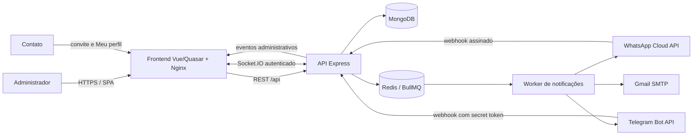
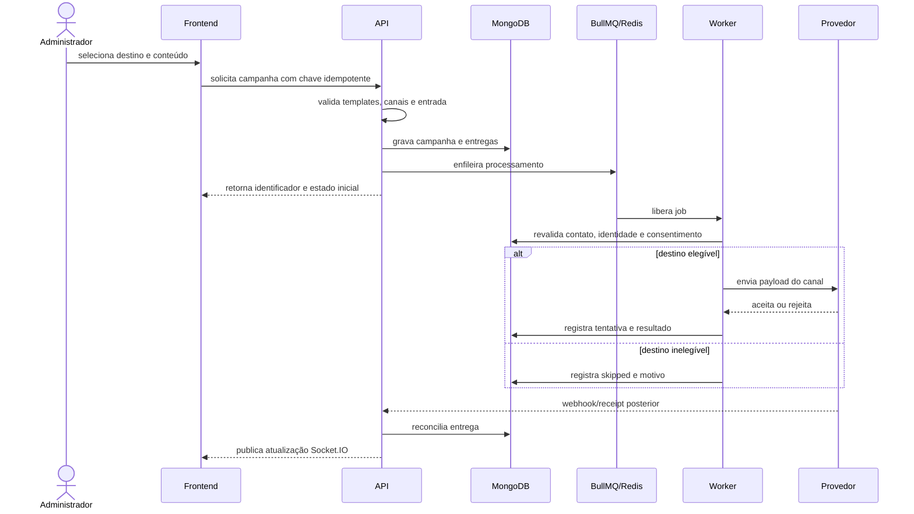

# Arquitetura do Notify Flow

## 1. Objetivo arquitetural

O Notify Flow foi estruturado para oferecer notificações multicanal com três propriedades centrais:

1. **consentimento verificável por contato e canal**;
2. **isolamento entre provedores**, para que a indisponibilidade de um canal não interrompa os demais;
3. **rastreabilidade**, desde a solicitação do disparo até o retorno assíncrono do provedor.

A solução adota uma SPA administrativa/pública, uma API modular, persistência durável no MongoDB, coordenação de filas no Redis/BullMQ e integração em tempo real por Socket.IO.

## 2. Contexto do sistema



O Nginx é a borda pública da implantação Render. Ele entrega a SPA, encaminha `/api` para a API privada e faz upgrade de `/socket.io`. No desenvolvimento local, os mesmos caminhos são mantidos pelo proxy do Vite ou pelo Docker Compose.

## 3. Componentes

| Componente | Tecnologia | Responsabilidade |
|---|---|---|
| Frontend | Vue 3, Quasar, Pinia, Vue Router, Axios | Interface administrativa e pública, builders, previews, tabelas, chats e estado de sessão. |
| Borda web | Nginx | Assets estáticos, fallback SPA, headers de segurança e proxy same-origin. |
| API | Node.js 20+, Express | Autenticação, validação, casos de uso, webhooks, contatos, templates, privacidade e administração. |
| Persistência | MongoDB/Mongoose | Estado durável, auditoria, contatos, campanhas, templates, conversas e configurações. |
| Fila | Redis + BullMQ | Jobs, atrasos, retries e desacoplamento do processamento das requisições HTTP. |
| Realtime | Socket.IO | Atualização incremental de chats, webhooks, contatos, logs e avisos administrativos. |
| Provedores | Meta, Telegram e Gmail | Entrega/recebimento conforme as políticas de cada canal. |

## 4. Organização lógica da API

A API segue predominantemente o fluxo:

```text
rota -> middleware/DTO -> controller -> manager -> model/service -> provedor
```

- **Rotas** definem o contrato HTTP e aplicam autenticação/validação.
- **DTOs com Zod** rejeitam payloads incompatíveis antes da regra de negócio.
- **Controllers** convertem a requisição em chamadas de aplicação e padronizam respostas.
- **Managers** coordenam casos de uso, transações lógicas e regras de domínio.
- **Models** representam o estado persistente no MongoDB.
- **Services** encapsulam filas, criptografia, mídia segura, Socket.IO, SMTP e APIs externas.

Domínios de rota existentes incluem autenticação, contatos, grupos, conversas, Gmail, convites, logs, notificações, privacidade, perfil, configurações, sistema/armazenamento, Telegram, mídia, conjuntos, templates, termos e WhatsApp Cloud.

## 5. Domínios persistidos

As coleções derivam dos modelos Mongoose e podem variar de nome físico conforme a pluralização do ODM. Os principais domínios são:

| Domínio | Exemplos de dados |
|---|---|
| Administração | administradores, refresh tokens e notificações da central. |
| Contatos e consentimento | contato consolidado, identidades de canal, eventos de consentimento e origem por convite. |
| Segmentação | grupos, convites, cliques e vínculos de participação. |
| Conteúdo | templates por canal, conjuntos de templates e mídias associadas. |
| Campanhas | notificação, entregas por contato/canal, tentativas e estado agregado. |
| Provedores | receipts, eventos do webhook WhatsApp e logs operacionais. |
| Conversas | conversas, mensagens e backups de conversação. |
| Meu perfil | challenges de autenticação e desafios de confirmação de email em chat. |
| Configuração | settings criptografados, white-label e links úteis. |
| Governança | documentos legais e auditorias administrativas. |

Mídias e backups binários utilizam recursos de armazenamento do MongoDB, incluindo GridFS quando aplicável. A tela White-label expõe uso por coleção, exportação e limpeza controlada, mas não substitui uma política externa de backup.

## 6. Fluxo de uma campanha



A revalidação no worker é deliberada: um contato pode revogar permissão após o enfileiramento. Assim, a autorização observada na tela de revisão não é tratada como autorização irrevogável.

### 6.1 Estados e isolamento

Cada combinação contato/canal mantém estado próprio. Resultados típicos são:

- `queued`: aguardando processamento;
- `sent`: aceito pelo provedor;
- `delivered` ou `read`: atualizado por receipt, quando disponível;
- `skipped`: não elegível por configuração, identidade ou consentimento;
- `failed`: falha após a política de tentativas aplicável.

O estado agregado pode ser parcial. Uma falha no WhatsApp, por exemplo, não deve impedir Telegram ou Gmail do mesmo contato ou lote.

### 6.2 Fila e recuperação

O worker BullMQ atual processa até **cinco jobs simultaneamente**. Jobs comuns admitem até quatro tentativas por padrão, com backoff exponencial, limitado e revalidação antes de nova chamada externa.

O erro Meta `131049`, relacionado a proteção do ecossistema/engajamento, possui tratamento específico: a entrega pode ser reagendada uma única vez para aproximadamente 24 horas depois, sem bloquear outras campanhas do contato. Repetição adicional depende de ação administrativa explícita.

O MongoDB preserva o estado da campanha e permite a recuperação de notificações que ficaram sem job ativo. Redis é o coordenador da execução, não a única fonte de verdade do negócio.

## 7. Fluxos de entrada e conversa

### 7.1 WhatsApp Cloud

O webhook oficial alimenta eventos e conversas locais. Mensagens de usuário abrem/renovam uma janela de atendimento de 24 horas para texto livre; fora dela, mensagens iniciadas pela organização dependem de template aprovado.

A API da Meta não oferece ao produto importação completa da lista ou do histórico do aplicativo. Por isso, a inbox do Notify Flow é uma projeção construída com webhooks recebidos e envios realizados pelo sistema.

Eventos técnicos ou tipos não suportados são preservados no log de webhook. Eles podem ser apresentados no chat como diagnóstico quando contêm informação útil, sem criar automaticamente um contato confiável.

### 7.2 Telegram

O bot só conhece um chat privado depois de uma interação. O webhook processa mensagens, comandos, contatos compartilhados e callbacks de menus. `chat_id` e identidade do Telegram são mantidos separados do telefone até que haja vínculo verificável.

### 7.3 Gmail

Gmail é um canal de saída via SMTP. Texto e HTML são tratados separadamente, e HTML é sanitizado para preview e composição segura. Uma configuração opcional pode enviar, pelo Gmail configurado, um aviso ao administrador quando chega nova mensagem por webhook de WhatsApp ou Telegram.

## 8. Identidade, consentimento e deduplicação

Um contato lógico pode possuir identidades independentes de WhatsApp, Telegram e email. A deduplicação não se baseia apenas em nome de exibição: utiliza identificadores normalizados e vínculos confirmados.

O consentimento também é independente por canal e registra proveniência, por exemplo:

- comando iniciado pelo titular;
- ação no Meu perfil;
- decisão administrativa confirmada;
- revogação pelo titular, bloqueio do bot ou erro permanente do provedor.

No WhatsApp, o comando configurado pode autorizar a integração oficial identificada; no Telegram, o usuário precisa iniciar o bot. Email só entra em campanha quando o endereço foi associado e o respectivo consentimento está ativo.

## 9. Templates e conjuntos

O modelo de conteúdo possui duas camadas:

- **template por canal**: representa conteúdo compatível com Telegram, WhatsApp Cloud ou Gmail;
- **conjunto**: associa de um a três templates, no máximo um por canal, com vínculo opcional a um convite.

Para WhatsApp Cloud, o nome, idioma, componentes e ordem dos parâmetros precisam coincidir com o template aprovado na Meta. A interface monta o payload sem exigir edição manual de JSON, oferece preview e distingue valores fixos daqueles definidos em cada disparo.

Uploads de mídia geram referências controladas pelo backend. O botão de salvar permanece bloqueado durante upload. Ao remover/desvincular uma mídia, a aplicação verifica referências para evitar apagar um ativo ainda utilizado e remove mídia órfã conforme o ciclo implementado.

## 10. Realtime e consistência

Socket.IO acelera a percepção de atualização, mas não é a fonte exclusiva da tela. A estratégia é:

1. fetch inicial autenticado;
2. eventos incrementais enquanto a página está montada;
3. reconexão e novo fetch após perda de conexão, deploy ou expiração de token.

Eventos cobrem mensagens/conversas, webhooks, logs, contatos e notificações administrativas. O socket administrativo exige JWT válido e desconecta quando a sessão expira.

## 11. White-label e administração de armazenamento

O domínio White-label permite configurar identidade visual, como nome, logo, cores e links institucionais/úteis, sem alterar o núcleo do produto. A configuração pública expõe apenas campos necessários à renderização; ações administrativas continuam protegidas.

O painel de armazenamento consulta uso geral e por coleção, permite exportação JSON, empacotamento de imagens e limpeza confirmada. Operações de manutenção utilizam trava temporária e geram log de auditoria. Durante manutenção, rotas mutáveis podem ser protegidas para evitar inconsistência.

## 12. Qualidades e decisões

| Qualidade | Decisão |
|---|---|
| Disponibilidade parcial | Provedores independentes e resultados por canal. |
| Auditabilidade | Campanha e entrega persistidas; webhook/receipt reconciliado. |
| Segurança | JWT, refresh em cookie HttpOnly, validação Zod, Helmet, rate limit e segredos cifrados. |
| Privacidade | Consentimento granular, revogação, retenção e área do titular. |
| Usabilidade | Builders e previews evitam JSON manual para o operador. |
| Portabilidade | Docker Compose local e Render Blueprint em YAML. |
| Operabilidade | Health checks, logs, central realtime e painel de armazenamento. |
| Extensibilidade | Managers/services e adaptadores por canal. |

## 13. Limitações conhecidas

- Entrega depende de disponibilidade, políticas, limites, qualidade e cobrança dos provedores.
- O Notify Flow não transforma conteúdo arbitrário em template automaticamente aprovado pela Meta.
- A inbox WhatsApp não é um espelho completo do aplicativo WhatsApp.
- Socket.IO precisa reconectar após deploys ou manutenção.
- Redis e MongoDB continuam sendo dependências críticas; recuperação e backup precisam ser operados.
- A configuração atual mantém o worker no processo da API. Escala horizontal requer separar workers e adicionar coordenação apropriada para Socket.IO.
- O ensaio com 20 a 30 usuários valida o fluxo funcional observado, não a capacidade máxima.

## 14. Evolução recomendada

- separar API e worker em processos escaláveis;
- adicionar adapter Redis ao Socket.IO em múltiplas instâncias;
- implantar métricas de latência, profundidade de fila e taxa de erro por provedor;
- formalizar testes de carga com dados sintéticos e critérios de aprovação;
- automatizar backup/restauração e testes de desastre;
- ampliar testes de contrato com fixtures versionadas dos webhooks;
- documentar migrações de schema e compatibilidade entre releases.

