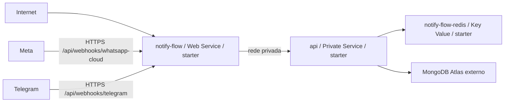

# Implantação e operação do Notify Flow

## 1. Escopo

Este guia descreve dois cenários suportados pelo repositório:

- ambiente local integrado com Docker Compose;
- implantação em produção pelo Render Blueprint (`render.yaml`), MongoDB Atlas e Render Key Value.

Os exemplos não contêm credenciais reais. Nunca reutilize valores publicados em histórico, print, log ou conversa.

## 2. Pré-requisitos

### Execução por containers

- Docker Engine/Desktop 24 ou superior;
- Docker Compose v2;
- 4 GB de memória livre como referência mínima para o conjunto local;
- portas locais 8080 e 3000 livres ou substituídas no `.env`.

### Execução sem containers

- Node.js 20 ou superior;
- MongoDB 7 compatível;
- Redis 7 compatível;
- npm com suporte ao lockfile do projeto.

### Integrações externas

- URL HTTPS pública para webhooks;
- bot Telegram e token emitido pelo BotFather;
- app Meta, WABA, Phone Number ID, token e webhook configurados;
- conta Gmail com método de autenticação aceito, normalmente app password.

## 3. Preparação segura do ambiente

Copie o catálogo local:

```powershell
Copy-Item .env.example .env
```

Preencha o `.env` local sem remover o `.env.example`. Os grupos indispensáveis são:

| Grupo | Exemplos |
|---|---|
| URLs | `PUBLIC_APP_URL`, `CORS_ORIGINS`, `API_PORT`, `FRONTEND_PORT` |
| Bancos | `MONGODB_URI`, `REDIS_URL`, `REDIS_REQUIRED` |
| Administração | `ADMIN1_EMAIL`, `ADMIN1_PASSWORD` |
| Sessões | `JWT_ACCESS_SECRET`, `JWT_REFRESH_SECRET`, TTLs |
| Perfil | `PROFILE_JWT_SECRET`, `INVITE_TOKEN_SECRET`, TTLs e limites |
| Criptografia/pesquisa | `ENCRYPTION_KEY`, `SEARCH_HASH_KEY` |
| Segurança HTTP | `TRUST_PROXY`, `COOKIE_SECURE`, rate limits e bloqueio de IP |
| Canais | credenciais e identificadores de Meta, Telegram e Gmail, quando fornecidos por ambiente |

Para gerar segredos aleatórios com OpenSSL:

```powershell
openssl rand -base64 48
```

Ou, com Node.js:

```powershell
node -e "console.log(require('crypto').randomBytes(48).toString('base64url'))"
```

Use valores diferentes para cada finalidade. Não use o mesmo segredo de JWT como chave de criptografia, verify token ou segredo de convite.

## 4. Execução local com Docker Compose

Na raiz:

```powershell
docker compose config --quiet
docker compose up --build -d
docker compose ps
```

Endpoints locais:

- painel: <http://localhost:8080>;
- health do frontend: <http://localhost:8080/healthz>;
- health ponta a ponta: <http://localhost:8080/api/health>;
- API diretamente na interface loopback: <http://localhost:3000/api/health>.

O Compose cria:

| Serviço | Função | Persistência |
|---|---|---|
| `frontend` | Nginx + SPA e proxy para API/Socket.IO | imagem imutável |
| `api` | aplicação Express, worker e realtime | estado durável externo |
| `mongo` | banco local | volume `mongo_data` |
| `redis` | fila e recursos temporários | volume `redis_data` |

O frontend só é iniciado depois do health da API; a API depende de MongoDB e Redis saudáveis.

### Operação básica

```powershell
docker compose logs -f api
docker compose logs -f frontend
docker compose restart api
docker compose down
```

Evite `docker compose down --volumes`: o parâmetro remove `mongo_data` e `redis_data` e deve ser usado apenas quando a perda desses dados for intencional.

## 5. Desenvolvimento fora do Compose

API:

```powershell
Set-Location api
npm ci
npm run dev
```

Frontend:

```powershell
Set-Location frontend
npm ci
npm run dev
```

O Vite usa porta 9000 e encaminha `/api` e `/socket.io` para o destino de desenvolvimento. MongoDB e Redis precisam estar disponíveis e coerentes com as variáveis da API.

## 6. Render Blueprint

O arquivo de infraestrutura como código é [`render.yaml`](../render.yaml). Render Blueprints usam YAML; `render.xml` não é um formato aplicável.

O Blueprint provisiona:



Os três recursos Render estão configurados com plano `starter` e região `oregon`. A API privada não recebe URL pública; o frontend Nginx é a única borda e encaminha API e WebSocket.

### 6.1 Primeiro sync

1. conecte o repositório ao Render;
2. selecione o `render.yaml` da raiz;
3. revise nomes, planos e região antes de confirmar custos;
4. informe `MONGODB_URI`, `ADMIN1_EMAIL` e `ADMIN1_PASSWORD` nos campos `sync: false`;
5. aguarde Key Value e API ficarem disponíveis;
6. valide o health do frontend e, depois, `/api/health`;
7. configure os canais pela interface ou por variáveis seguras do serviço.

O Blueprint define `PUBLIC_APP_URL` e `CORS_ORIGINS` como `https://notify-flow.onrender.com`. Em outro domínio, altere ambos antes do deploy.

### 6.2 Banco de dados

O Render não fornece MongoDB gerenciado neste Blueprint; a produção usa uma URI externa, normalmente MongoDB Atlas.

Requisitos mínimos:

- conexão SRV/TLS;
- usuário com privilégio apenas no banco da aplicação;
- senha exclusiva e rotacionável;
- restrição de rede compatível com a saída do Render;
- índices habilitados por `MONGODB_ENSURE_INDEXES=true`;
- backup e política de retenção configurados fora do código.

Não inclua a URI em `render.yaml`, `.env.example`, README, print ou ticket.

### 6.3 Redis/Key Value

`REDIS_URL` é injetada pelo vínculo `fromService`. `REDIS_REQUIRED=true` faz a inicialização falhar quando a fila não estiver disponível, evitando que uma instância de produção aceite campanhas sem mecanismo de processamento.

A política `noeviction` prioriza previsibilidade dos jobs; monitore memória para evitar falha por esgotamento.

### 6.4 Proxy Nginx

No Compose, `API_UPSTREAM=api:3000`. No Render, o Blueprint injeta o `hostport` privado real. O entrypoint do frontend normaliza o hostname com o domínio de busca da rede interna antes de iniciar o Nginx.

Pontos públicos:

- `https://notify-flow.onrender.com/` — SPA;
- `https://notify-flow.onrender.com/api/...` — API via proxy;
- `https://notify-flow.onrender.com/socket.io/...` — realtime via upgrade WebSocket;
- `https://notify-flow.onrender.com/healthz` — saúde da borda;
- `https://notify-flow.onrender.com/api/health` — teste ponta a ponta.

## 7. Configuração dos provedores

### 7.1 WhatsApp Cloud

Configuração típica na tela Início:

- access token;
- Phone Number ID;
- WhatsApp Business Account ID;
- número público com DDI;
- verify token;
- app secret;
- versão da Graph API.

Callback:

```text
https://SEU_DOMINIO/api/webhooks/whatsapp-cloud
```

O verify token cadastrado na Meta precisa ser idêntico ao salvo na aplicação. Para POST, o app secret permite verificar a assinatura. Assine pelo menos o campo `messages` e apenas os demais campos efetivamente usados.

Templates precisam existir na WABA do número remetente, estar aprovados e usar exatamente o mesmo nome, idioma, componentes e parâmetros registrados no Notify Flow.

### 7.2 Telegram

Callback:

```text
https://SEU_DOMINIO/api/webhooks/telegram
```

O painel pode montar a URL e registrar o webhook automaticamente. O segredo deve ser mantido no servidor e é validado pelo header `X-Telegram-Bot-Api-Secret-Token`.

O bot não consegue iniciar conversa privada com uma pessoa que nunca o iniciou. Divulgue o link do bot ou um convite e aguarde a primeira interação.

### 7.3 Gmail

Configure a conta autenticada, app password, email/nome do remetente e, opcionalmente, um endereço que receberá alertas de novas mensagens de WhatsApp/Telegram.

O destinatário de alertas pode ser igual ao remetente, mas a organização deve evitar loops externos e controlar volume. Salvar Gmail não torna automaticamente um email de contato autorizado para campanhas.

## 8. White-label, mídia e armazenamento

A configuração White-label é salva na API e aplicada pelo frontend. Logo pode ser informado por URL ou upload, respeitando os limites do backend.

O painel de armazenamento permite:

- visualizar consumo total e por coleção;
- exportar uma coleção ou o conjunto autorizado de dados em JSON;
- exportar imagens em ZIP;
- limpar dados por coleção ou de forma geral, com confirmação;
- consultar o console de auditoria das operações.

Operações de limpeza são destrutivas. Antes de executá-las:

1. confirme escopo e tamanho;
2. exporte os dados;
3. valide o arquivo baixado;
4. registre responsável e justificativa;
5. execute em janela de manutenção;
6. faça smoke test após a liberação da trava.

## 9. Observabilidade

Observe pelo menos:

- health de frontend e API;
- uso e conexões do MongoDB;
- memória/latência do Redis;
- profundidade e atraso da fila;
- taxa de `sent`, `delivered`, `read`, `skipped` e `failed` por canal;
- erros HTTP/Graph do WhatsApp;
- falhas de webhook/assinatura;
- reconexões Socket.IO;
- operações administrativas de exportação e limpeza.

Logs devem conter request ID e contexto técnico suficiente, mas não tokens, app passwords, códigos de sessão ou corpo sensível integral.

## 10. Backup e restauração

### MongoDB

Use os recursos do Atlas ou ferramentas compatíveis com a versão do servidor. Um backup útil deve incluir dados, índices e GridFS. Teste restauração em banco separado antes de depender dela.

### Redis

Redis coordena jobs e estados temporários; a política AOF local e a persistência do serviço gerenciado reduzem perdas, mas não substituem o MongoDB como fonte de estado. Após restauração, reconcilie campanhas persistidas com jobs ativos.

### Conversas

Mensagens locais possuem retenção. Backups manuais/automáticos de conversas são recursos operacionais específicos e não equivalem ao backup completo do banco.

## 11. Atualização e rollback

Antes de atualizar:

1. registre commit/imagem atual;
2. faça backup consistente;
3. execute testes e build;
4. valide compatibilidade de schema;
5. verifique fila atrasada e campanhas em andamento;
6. implante e monitore health/logs;
7. execute smoke test de um contato sintético por canal.

Rollback:

- restaure o commit/imagem anterior quando o schema continuar compatível;
- evite rollback de aplicação sobre migração destrutiva sem plano reverso;
- não apague jobs para “corrigir” estado sem comparar com campanhas no MongoDB;
- documente incidente, impacto e ação tomada.

## 12. Checklist rápido de produção

- [ ] domínio e HTTPS válidos;
- [ ] `PUBLIC_APP_URL` e CORS corretos;
- [ ] secrets exclusivos e fora do Git;
- [ ] cookie seguro e proxy confiável;
- [ ] Atlas autenticado, TLS e backup;
- [ ] Redis privado e monitorado;
- [ ] webhooks verificados e assinados;
- [ ] templates Meta aprovados;
- [ ] limites/custos dos provedores compreendidos;
- [ ] destinatários sintéticos de teste disponíveis;
- [ ] política de retenção e incidente definida;
- [ ] smoke test após deploy;
- [ ] rollback documentado.

## 13. Empacotamento da entrega acadêmica

O arquivo do Gate 5 deve conter código e documentação reproduzíveis, sem dados de operação. Exclua `.env`, `.git`, `node_modules`, `dist`, `coverage`, caches, logs e dumps reais.

O repositório informado para a entrega é <https://github.com/samuelvictorol/tcc-prti-samuelvictor>. A URL do ambiente Render é uma demonstração e não substitui o repositório nem a documentação de reprodução.

